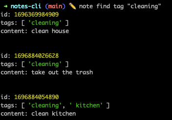
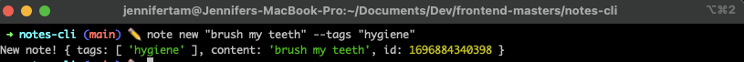

# Notes CLI
A headless CLI application built to expedite the need for taking nodes without a graphical user interface.




# Instructions
1) Pull down repo.
2) Create sym link to run CLI locally on your computer
```
npm link
```

> Type `which node` or `which note` to determine bin file path and confirm command name is registered

3) Now you should be able to run the note commands in your terminal and create and track your notes!